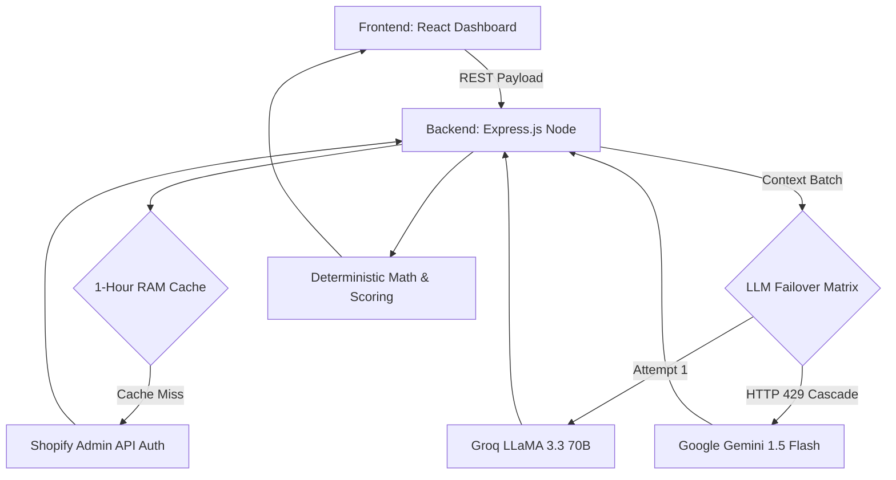

# StoreIQ — AI-Powered E-Commerce Optimization Platform

**StoreIQ** is an autonomous Shopify integration platform designed to close the gap between *what a merchant thinks they are selling* and *what a customer actually reads*. It combines robust deterministic modeling (scoring product structures) with advanced generative LLMs to perform full-store audits, assign perception priorities, and write conversion-optimized SEO descriptions that sync live to Shopify.

---

## 📖 Complete Documentation Index
1.  [Platform Operation Workflow](#1-platform-operation-workflow-the-core-flow)
2.  [The Perception Engine Module](#2-the-perception-engine-intent-vs-reality)
3.  [Software Architecture & Hybrid Scoring](#3-software-architecture--hybrid-scoring)
4.  [Technical Specifications & API Routes](#4-technical-specifications--api-routes)
5.  [Hardware & Service Requirements](#5-hardware--service-requirements)
6.  [Local Setup & Environment Config](#6-local-setup--environment-config)

---

## 1. Platform Operation Workflow (The Core Flow)

The platform follows a strict, safe, and highly cached 5-step operational pipeline:

**Step 1. The Global Store Scan**
When the user initializes an audit, the node backend leverages Shopify's Admin API to fetch the active product catalog. To restrict API exhaustion, the system batches 5 products at a time, sending an optimized JSON schema to the AI. Results are mapped and cached for 60-minutes in-memory.

**Step 2. The Four Pillars Scoring**
The AI-returned analysis is passed into a Deterministic Logic matrix. The application judges every product on a 0-100 scale across:
*   **Completeness:** Checks for active images, descriptions, and variant clarity.
*   **Clarity:** Enforces brevity and watches for AI-flagged ambiguous text.
*   **Visibility:** Calculates SEO keyword density and title length.
*   **Trust:** Enforces customer policies and review signals.
The dashboard instantly sorts the catalog so the poorest performers are presented first.

**Step 3. Micro-Analysis & Perception Mapping**
A merchant can click the **AI Perception Engine** on any product. This isolates the product into a specialized LLM pipeline comparing *Merchant Intent* vs *Buyer Perception*. It explicitly uncovers missing specs or market contradictions.

**Step 4. Auto-Diagnose & Generation**
Once issues are mapped, clicking **Auto-Fix** forces the AI to consume the identified gaps and rewrite the item. The AI outputs a pristine, HTML-formatted description, an SEO-optimized title (max 80 chars), and hidden meta-keywords. 

**Step 5. Production Synchronization**
Upon review, clicking **Apply Fix to Shopify** intercepts with a safety `confirm` prompt. Once authorized, the backend executes an `HTTP PUT` backward into the active Shopify GraphQL/Admin pipeline, making the changes live immediately. The improvement is permanently logged in the **Fix History** tab.

---

## 2. The Perception Engine (Intent vs Reality)

This is StoreIQ's flagship analytical module designed to rank workflow priorities.

**Calculation Parameters:**
1.  **Merchant Intent Formulation:** The AI summarizes exactly what the store *thinks* it's promoting.
2.  **Buyer Perception Formulation:** The AI extracts standard inferences of what a typical browser would assume reading the page.
3.  **The Perception Gap:** It categorically highlights:
    *   `Missing Fields:` Tangible omissions (e.g., Lack of sizing dimensions, material specs).
    *   `Ambiguities:` Overly subjective descriptors limiting conversion (e.g., "The best quality ever").
    *   `Contradictions:` Where titles mismatch HTML body text.
4.  **Priority Matrix Engine:** Every gap is fed into an $Impact \div Effort$ calculation. Fixes producing maximum impact with minimal effort are labeled 🔴 **HIGH Priority**, steering the merchant to highly efficient day-one conversions.

---

## 3. Software Architecture & Hybrid AI

StoreIQ operates as a decoupled React/Node stack heavily dependent on graceful AI failovers.



**The Cascading Fallback Framework:**
Because free-tier LLM providers have aggressive rate limits, our backend traps standard 429 warnings from Groq (the primary, high-speed engine). Rather than breaking the UI, it actively cascades the prompt over to Google's Gemini Flash architecture implicitly, ensuring total zero-downtime auditing.

---

## 4. Technical Specifications & API Routes

All internal API queries are handled through `http://localhost:3001/api/`.

### Auditing Routes
| Method | Endpoint | Description |
|---|---|---|
| `POST` | `/audit/store` | Primary catalog intake. Returns cached `results` matrix of all products and computed averages. |
| `POST` | `/audit/auto-fix` | Demands a generative LLM rewrite targeting specific `gaps_detected` in a single product. |

### Diagnostic Routes
| Method | Endpoint | Description |
|---|---|---|
| `POST` | `/perception-analysis` | Sends title/description to extract Merchant Intent, rank Priority Issues `(impact / effort)`, and return AI Confidence score `0-100%`. |
| `POST` | `/chat` | Continuous conversational loop passing active product JSON, store context, and message history to generate highly relevant guidance. |

### Operational Routes
| Method | Endpoint | Description |
|---|---|---|
| `POST` | `/update-product` | The Shopify Sync initiator. Requires `product_id`, `fixed_title`, and `body_html`. |
| `GET` | `/history` | Pulls the active session log mapping "Score Lift" from completed updates. |

---

## 5. Hardware & Service Requirements

**Local Machine Constraints:**
*   Node.js runtime environment (v18.0+)
*   Min 512MB RAM available for Node process auditing arrays.

**External Dependencies:**
*   **Shopify Token:** Requires an Admin access token (`shpat_XXXXX`) with explicitly authorized `read_products` and `write_products` permission scopes. 
*   **Groq Cloud:** Requires active Developer API key. 
*   **Google AI Studio:** (Optional but Recommended) Requires Gemini API key for the failover fallback capability.

---

## 6. Local Setup & Environment Config

1.  **Clone down the latest repository.**
2.  Install dependencies:
    ```bash
    npm install
    ```
3.  Establish API credentials securely by creating a `.env` in the root:
    ```bash
    cp .env.example .env
    ```
    ```env
    GROQ_API_KEY=gsk_your_groq_key
    VITE_GEMINI_API_KEY=AI_your_gemini_key
    SHOPIFY_STORE_DOMAIN=your-store.myshopify.com
    SHOPIFY_ACCESS_TOKEN=shpat_your_secure_shopify_token
    ```
4.  **Launch the System:**
    Due to the decoupling, initialize both services in separate terminal instances:
    
    *Runtime 1 (Backend Controller):*
    ```bash
    node server.js
    ```
    
    *Runtime 2 (React UI Client):*
    ```bash
    npm run dev
    ```
    Navigate natively to `http://localhost:5173` to interact with the platform.
