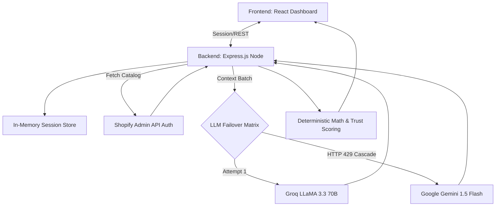

# StoreIQ — AI-Powered E-Commerce Optimization Platform

**StoreIQ** is an autonomous Shopify integration platform designed to close the gap between *what a merchant thinks they are selling* and *what a customer actually reads*. It combines robust deterministic modeling (scoring product structures) with advanced generative LLMs to perform full-store audits, assign perception priorities, conduct trust analysis, and act as a virtual ecommerce consultant—ultimately syncing conversion-optimized descriptions live to Shopify.

---

## 📖 Complete Documentation Index
1. [Platform Features & Product Capabilities](#1-platform-features--product-capabilities)
2. [Technical Architecture & Scoring Models](#2-technical-architecture--scoring-models)
3. [Security & Authentication Flow](#3-security--authentication-flow)
4. [Detailed API Specifications](#4-detailed-api-specifications)
5. [Hardware & Service Requirements](#5-hardware--service-requirements)
6. [Local Setup & Environment Config](#6-local-setup--environment-config)
7. [Production Deployment (Vercel & Render)](#7-production-deployment-vercel--render)

---

## 1. Platform Features & Product Capabilities

The platform is designed to emulate a top-tier e-commerce agency auditing a store natively.

**Step 1. Seamless Store Connection**
Merchants simply enter their `.myshopify.com` domain in the intuitive glassmorphism UI. Authentication acts seamlessly without forcing merchants to expose or paste raw API keys into the browser (keys are strictly managed server-side).

**Step 2. The Global Store Scan & Dashboard**
When the user initializes an audit, the Node backend fetches the active product catalog. The Store-Level Dashboard instantly generates aggregated analytics:
*   **Overall Store Health Score:** Averaged out across all active listings.
*   **AI Confidence Average:** A real-time metric denoting how confident the AI is in accurately understanding the store's inventory.
*   **Gap Identification Metrics:** Calculates the exact percentage of the catalog suffering from missing descriptions, critically low clarity, or absent trust signals.

**Step 3. Trust & Policy Analysis Engine**
Beyond standard product descriptions, the **TrustPanel** deeply analyzes the store for critical merchant trust signals: Shipping Policies, Return Frameworks, Privacy transparency, and Customer Review presence. Missing signals dynamically deduct up to 20 points each from the overall catalog confidence.

**Step 4. Micro-Analysis & AI Perception Engine**
Clicking **Diagnose** on a product routes it into the Perception Engine. This isolates the product to map *Merchant Intent* vs *Buyer Perception*. It uncovers:
*   **Missing Fields:** Omissions like sizing dimensions or material specs.
*   **Ambiguities:** Overly subjective descriptors limiting conversion.
*   **Contradictions:** Areas where the title mismatches the HTML body.

**Step 5. AI Store Consultant (Chat)**
Rather than generic chatbot functionality, the integrated **AI Store Consultant** leverages strict system prompts to act as a specialized ecommerce advisor. Merged with the session's active store context and audit metrics, it provides actionable, prioritized business advice.

**Step 6. Auto-Diagnose & Production Synchronization**
Clicking **Auto-Fix** forces the AI to execute a rewrite targeting the gaps. Upon verifying the AI's proposal, **Apply Fix to Shopify** executes an `HTTP PUT` backward into the active Shopify framework via a secure backend tunnel, making the changes live instantly.

---

## 2. Technical Architecture & Scoring Models

StoreIQ operates as a decoupled React/Node stack heavily dependent on graceful AI failovers.



### The Hybrid Scoring System
To prevent AI hallucination and ensure stability, the backend relies on algorithmic baseline grading blended with AI analysis:
1.  **Completeness & Visibility:** Deterministic character mapping, image count presence, and keyword density.
2.  **Trust Signals:** Deterministic policy checks penalizing catalogs lacking return schemas.
3.  **Clarity & Ambiguity:** Generative LLM logic identifying contradictory or overly subjective statements dynamically.
Every product subsequently maps an **AI Confidence Score (0-100)** to give the merchant an honest look at the audit's reliability.

---

## 3. Security & Authentication Flow

StoreIQ is built for merchant security. No sensitive tokens cross the network client-side.

*   **Token Isolation:** The `SHOPIFY_ACCESS_TOKEN` is injected strictly via the backend `.env`. 
*   **Client Connection:** The UI only prompts for the `storeDomain`. Upon submitting, the `POST /api/connect-store` establishes an isolated memory session tied to the server state.
*   **Route Protection:** The `requireConnection` Express middleware wraps all analytical and read/write endpoints, immediately returning `401 Unauthorized` if the active memory session is invalid.
*   **Safe Disconnect:** The `POST /api/disconnect-store` endpoint immediately purges server-state sessions, rendering future UI queries gracefully inactive and bouncing the user back to the connection prompt.

---

## 4. Detailed API Specifications

All internal API queries are handled through `http://localhost:3001/api/`.

### Authentication Routes
| Method | Endpoint | Description |
|---|---|---|
| `POST` | `/connect-store` | Accepts `{"storeDomain": "..."}`. Initiates server memory session. |
| `GET` | `/connection-status` | Verifies the backend session state and returns the active domain. |
| `POST` | `/disconnect-store` | Purges the active memory session and cuts Shopify interaction access. |

### Auditing Routes
| Method | Endpoint | Description |
|---|---|---|
| `POST` | `/audit/store` | Primary catalog intake. Calculates store-level averages, Trust metrics, and AI Confidence scores per product. |
| `POST` | `/audit/auto-fix` | Demands a generative LLM rewrite targeting specific `gaps_detected`. |

### Diagnostic Routes
| Method | Endpoint | Description |
|---|---|---|
| `POST` | `/perception-analysis` | Analyzes Merchant Intent vs Buyer Perception to flag conversion blockers. |
| `POST` | `/chat` | Continuous consultant loop constrained by strict ecommerce advising parameters. |

### Operational Routes
| Method | Endpoint | Description |
|---|---|---|
| `POST` | `/update-product` | Secure Shopify Sync initiator. Safely executes product overrides. |
| `GET` | `/history` | Pulls the active session log mapping "Score Lift" from applied fixes. |

---

## 5. Hardware & Service Requirements

**Local Machine Constraints:**
*   Node.js runtime environment (v18.0+)
*   Min 512MB RAM available for Node process auditing arrays.

**External Dependencies:**
*   **Shopify Token:** Requires an Admin Custom App access token (`shpat_XXXXX`) tightly scoped to `read_products` and `write_products`. 
*   **Groq Cloud:** Requires an active Developer API key. 
*   **Google AI Studio:** (Recommended Fallback) Requires a Gemini API key for zero-downtime auditing during rate limits.

---

## 6. Local Setup & Environment Config

1.  **Clone down the repository or unzip the build.**
2.  Install dependencies:
    ```bash
    npm install
    ```
3.  Establish API credentials securely by creating a `.env` in the root space:
    ```bash
    cp .env.example .env
    ```
    ```env
    GROQ_API_KEY=gsk_your_groq_key
    VITE_GEMINI_API_KEY=AI_your_gemini_key
    SHOPIFY_ACCESS_TOKEN=shpat_your_secure_shopify_token
    # Notice: SHOPIFY_STORE_DOMAIN is securely mapped dynamically via the Frontend UI now.
    ```
4.  **Launch the System Platforms:**
    Due to decoupling, launch both stacks concurrently in separate terminals:
    
    *Runtime 1 (Backend Controller):*
    ```bash
    node server.js
    ```
    
    *Runtime 2 (React UI Client):*
    ```bash
    npm run dev
    ```
    Navigate to `http://localhost:5173` to interact with the application safely.

---

## 7. Production Deployment (Vercel & Render)

StoreIQ is built with a decoupled architecture, making it perfectly suited for modern cloud hosting.

### Phase 1: Deploy Backend (Node.js/Express) to Render
1. Connect your repository to **Render.com** and create a new **Web Service**.
2. Set Build Command to `npm install` and Start Command to `node server.js`.
3. Add your Environment Variables:
   * `GROQ_API_KEY`
   * `VITE_GEMINI_API_KEY`
   * `SHOPIFY_ACCESS_TOKEN`
4. Deploy and copy your new live URL (e.g., `https://salesiq-backend.onrender.com`).

### Phase 2: Link Frontend to Live Backend
In your local code, update the API pointer to point to the live server.
1. Open `src/App.jsx` and `src/components/ConnectStore.jsx`.
2. Change `const API = 'http://localhost:3001/api';` to your new Render URL `const API = 'https://salesiq-backend.onrender.com/api';`.
3. Commit and push this change.

### Phase 3: Deploy Frontend (React) to Vercel
1. Connect your repository to **Vercel.com** and import the project.
2. Vercel will auto-detect Vite. Ensure the build command is `npm run build`.
3. Click **Deploy**. Vercel will instantly generate a live, secure HTTPS URL for your application interface.
